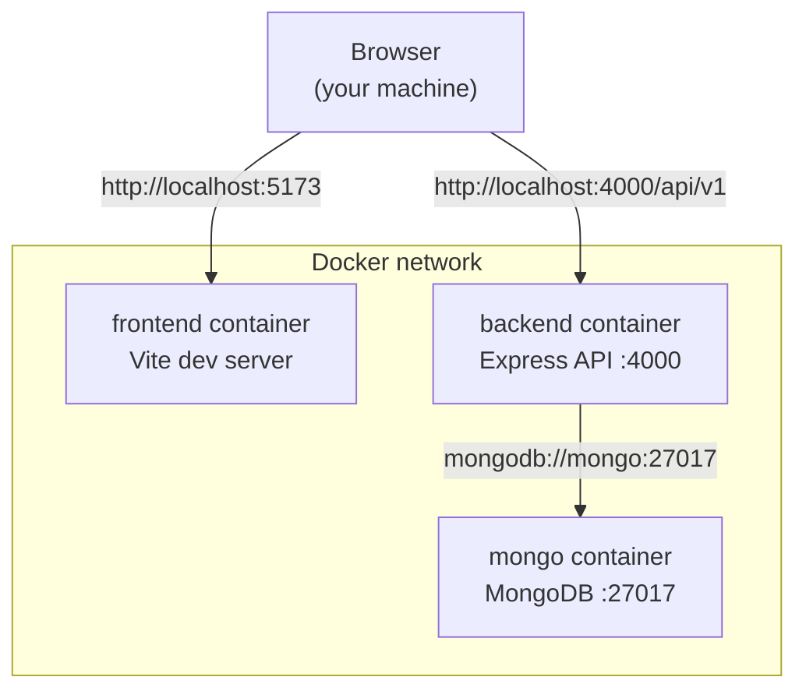
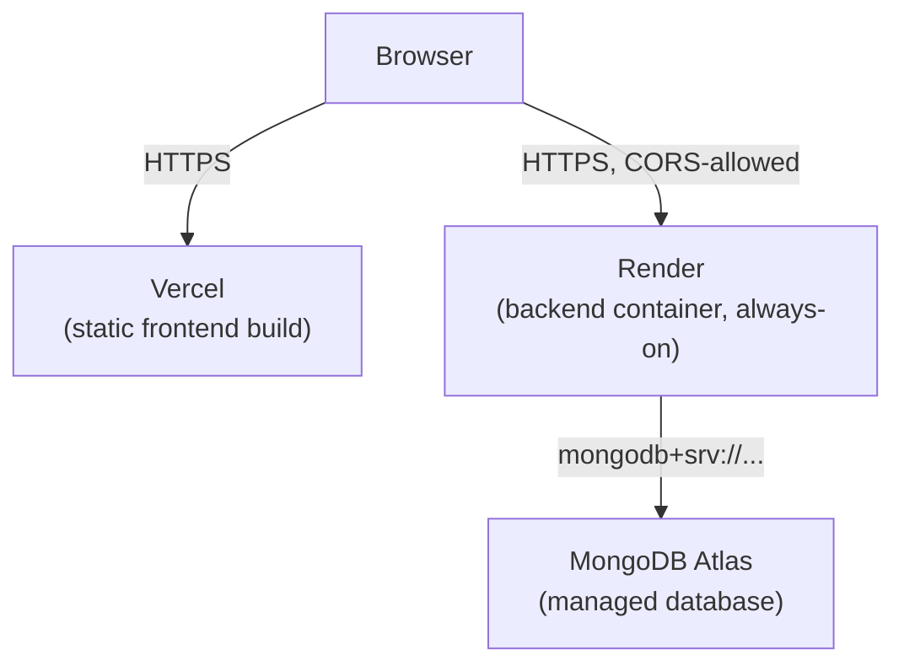

# Contour - Docker Setup & Deployment Guide

This is the complete reference for running Contour locally with Docker and deploying it to production. If you've never set this project up before, start at the top and follow it in order. If you already know Docker, skip to [§18 Fresh-machine quick start](#18-fresh-machine-quick-start).

The root [`README.md`](../README.md) has a short pointer to this file plus the non-Docker (host) setup instructions; this file is the detailed version.

---

## 1. Overview

Contour is an npm-workspaces monorepo: a React/Vite frontend, an Express/MongoDB backend, and a small shared Zod-schema package the other two depend on. Docker Compose provides the local infrastructure - MongoDB, and dev containers for the backend and frontend - so nothing application-specific needs to be installed on your machine besides Docker itself.

**What Docker provides:**
- A MongoDB instance (no local MongoDB install, no `mongosh`, no service/PATH setup).
- A backend container running the real Express API with hot reload.
- A frontend container running the real Vite dev server with hot reload.
- Correct startup ordering (backend won't start until MongoDB is actually ready).
- Persistent local data across restarts (until you explicitly reset it).

**What Docker does not change:** the application itself. Nothing about the backend, frontend, database schema, auth, or API is different when running through Docker - it wraps the same application you'd run directly on the host.

**Architecture:**



The browser talks to both the frontend and backend directly over published host ports - the frontend container is never a proxy for API calls. Only the backend talks to MongoDB, and only by the Compose service name `mongo`, which is a Docker-internal hostname the browser can't resolve.

---

## 2. Prerequisites

### Required on host
- **Docker Desktop** (Windows/macOS) or **Docker Engine + Compose plugin** (Linux).

### NOT required on host
- Node.js / npm
- MongoDB, `mongosh`, or any MongoDB tooling
- Any other project-specific runtime

(Node.js is only needed if you choose to run the app directly on the host instead of via Docker - see the root README's "Running without Docker" section.)

### Installing Docker

- **Windows:** Download and install [Docker Desktop for Windows](https://www.docker.com/products/docker-desktop/). WSL2 backend is the default and recommended option - the installer will prompt you to enable it if needed. Restart when asked.
- **macOS:** Download [Docker Desktop for Mac](https://www.docker.com/products/docker-desktop/) (choose Apple Silicon or Intel build to match your Mac). Drag it to Applications and launch it once.
- **Linux:** Install [Docker Engine](https://docs.docker.com/engine/install/) for your distribution, plus the Compose plugin (`docker-compose-plugin` on Debian/Ubuntu-based distros). Add your user to the `docker` group so you don't need `sudo` for every command: `sudo usermod -aG docker $USER` (log out/in afterward).

Confirm it's working:

```bash
docker --version
docker compose version
```

Both must print a version. If either errors, Docker isn't installed correctly or isn't running yet - start Docker Desktop (or `sudo systemctl start docker` on Linux) and try again.

---

## 3. Installation / repository setup

```bash
git clone <repository-url> contour
cd contour
```

If you already have the repository, just `cd` into its root (the directory containing this `docs/` folder and the top-level `docker-compose.yml`).

---

## 4. Environment setup

```bash
cp .env.example .env
```

**This step is optional for local development** - `docker compose up` works with built-in defaults even without a `.env` file. Copy it only if you want to override the local JWT secret or the published ports.

| Variable | Required? | Default | Purpose |
|---|---|---|---|
| `JWT_SECRET` | No | dev placeholder (32+ chars) | Signs auth tokens. The default is fine for local dev only - never reuse it anywhere real. |
| `JWT_EXPIRES_IN` | No | `7d` | JWT lifetime. |
| `BACKEND_PORT` | No | `4000` | Host port the backend API is published on. |
| `FRONTEND_PORT` | No | `5173` | Host port the frontend dev server is published on. |
| `MONGO_PORT` | No | `27017` | Host port MongoDB is published on (for Compass - see §9). |

This root `.env` is read by Docker Compose only. It is separate from `apps/backend/.env` / `apps/frontend/.env`, which are only used when running the app directly on the host without Docker - Compose derives `MONGO_URI`, `CORS_ORIGIN`, and `VITE_API_BASE_URL` itself from the container network topology (see §1 and §17), not from those files.

Nothing here requires a real secret or external credential for local development - MongoDB needs no credentials in this project's current architecture, and the JWT default is safe to use as-is locally.

---

## 5. First startup

```bash
docker compose up --build
```

First run builds the images (pulls the `mongo` and `node` base images, installs npm dependencies inside the containers) - this can take a few minutes depending on your connection. Subsequent runs are fast; use plain `docker compose up` once images exist, and only add `--build` again after changing a `Dockerfile`, a `package.json`, or a compose file.

You should see, in order:

1. `contour-mongo` logs ending with MongoDB accepting connections, then its healthcheck passing (`docker compose ps` will show it as `healthy`).
2. `contour-backend` logs ending with `contour-backend listening on port 4000 (development)`. If it instead exits with a Mongo connection error, MongoDB didn't finish becoming healthy in time before the backend's own retry attempts (see §10).
3. `contour-frontend` logs ending with a Vite `VITE ... ready in Xms` line.

---

## 6. Accessing the application

- **Frontend:** [http://localhost:5173](http://localhost:5173)
- **Backend API:** [http://localhost:4000/api/v1](http://localhost:4000/api/v1)
- **Health check:** [http://localhost:4000/health](http://localhost:4000/health) → `{"status":"ok","db":"connected","timestamp":"..."}` (or `503` with `status:"degraded"` if MongoDB is unreachable - the backend never reports healthy while the database is down)

Registering a user and using the app from here exercises the full stack end-to-end, including real MongoDB persistence.

(Ports above assume you didn't override `BACKEND_PORT`/`FRONTEND_PORT` in `.env` - if you did, substitute your values.)

---

## 7. Development workflow

```bash
docker compose up                       # start (foreground, logs streaming)
docker compose up -d                    # start in the background
docker compose down                     # stop - MongoDB data is PRESERVED
docker compose restart backend          # restart just the backend
docker compose logs -f backend          # follow backend logs
docker compose logs -f                  # follow all services' logs
docker compose exec backend sh          # shell into the running backend container
docker compose ps                       # see status/health of each service
```

**Hot reload:** edit files in `apps/backend/src`, `apps/frontend/src`, or `packages/shared/src` on your host machine as normal - both containers bind-mount the repository:

- Backend: `tsx watch` restarts the process on save.
- Frontend: Vite HMR updates the browser on save, no restart needed.
- `packages/shared`: rebuilt automatically each time a container **starts**. If you edit shared code while the stack is already running, restart the containers that consume it: `docker compose restart backend frontend`.

**Rebuilding images:** needed after changing a `Dockerfile`, adding/removing an npm dependency (`package.json`), or editing a compose file:

```bash
docker compose up --build
```

---

## 8. Database workflow

- **Where data lives:** a named Docker volume, `contour_mongo_data` - not inside the container's writable layer, so it survives container recreation.
- **Persistence:** `docker compose down` stops and removes containers but leaves the volume (and its data) intact. The next `docker compose up` reattaches to the same data.
- **Full reset:** `docker compose down -v` - the `-v` flag deletes the named volumes, including the MongoDB data. **This is destructive and irreversible.** Use it only when you actually want to start from an empty database.
- **Inspecting data:** see §9 (Compass) below, or `docker compose exec mongo mongosh` for a shell directly inside the container (this uses the `mongosh` bundled in the official `mongo` image - you still don't need it installed on your host).
- **Seeding:** this project has no seed script at present; create data through the running app (register a user, create a workspace, etc.).

---

## 9. MongoDB Compass (optional)

The `mongo` container publishes its port to your host machine, so [Compass](https://www.mongodb.com/products/tools/compass) (or any other MongoDB GUI) can connect directly. This is purely a convenience for inspecting data - **the application itself never requires Compass.**

Connection string:

```
mongodb://localhost:27017
```

(Or `mongodb://localhost:${MONGO_PORT}` if you overrode `MONGO_PORT` in `.env`.) Database name: `contour_dev`, created automatically on first write - it won't appear in Compass until the app has written something.

---

## 10. Troubleshooting

| Symptom | Diagnosis / Fix |
|---|---|
| `docker: command not found` | Docker isn't installed or isn't on `PATH` - reinstall/restart Docker Desktop, or on Linux confirm `dockerd` is running (`sudo systemctl status docker`). |
| Docker daemon isn't running | Docker Desktop: open the app and wait for the whale icon to show "running". Linux: `sudo systemctl start docker`. |
| Port `4000`, `5173`, or `27017` already in use | Something else on your machine is using it. Set `BACKEND_PORT` / `FRONTEND_PORT` / `MONGO_PORT` in `.env` (§4) to a free port, then `docker compose up`. |
| `contour-backend` exits immediately with a Mongo connection error | Usually transient on a slow first start - run `docker compose up` again. If it persists: `docker compose ps` to confirm `contour-mongo` shows `healthy`; if not, check `docker compose logs mongo` for the actual MongoDB error. |
| Frontend loads but API calls fail / CORS error in browser console | Confirm you're using matching ports end-to-end: the backend's `CORS_ORIGIN` and the frontend's `VITE_API_BASE_URL` are both derived from `BACKEND_PORT`/`FRONTEND_PORT` in `.env` - check `docker compose ps` shows the ports you expect. |
| Changes to `apps/*/src` aren't showing up | Confirm you're running `docker-compose.yml` (has source bind mounts), not `docker-compose.prod.yml` (has none, by design - see §12). |
| A new npm dependency I added isn't available in the container | Dependencies are installed at image-build time, not from your host `node_modules` - run `docker compose up --build` after changing any `package.json`. |
| Stale/weird behavior after pulling new code | `docker compose down && docker compose up --build`. |
| Environment variable change isn't taking effect | Env vars are read at container start, not live - `docker compose up` again after editing `.env` (a full restart, not just a page reload, is needed). |
| Build cache seems wrong / want a totally clean image rebuild | `docker compose build --no-cache <service>` (or `docker compose down -v && docker compose up --build` for a full reset of both images and data). |
| Want a completely clean database only | `docker compose down -v`, then `docker compose up`. |

---

## 11. Clean reset

```bash
docker compose down       # stop - MongoDB data preserved
docker compose down -v    # stop AND delete the MongoDB data volume - destroys local data, irreversible
```

Use plain `down` between ordinary sessions. Use `down -v` only when you deliberately want to wipe your local database and start over.

---

## 12. Production-style local verification (optional)

`docker-compose.prod.yml` runs the actual compiled backend (`node dist/index.js`) and a static Nginx-served frontend build, with **no source bind mounts** - this is deliberately not for day-to-day development (no hot reload), but useful for confirming the real build output works before deploying:

```bash
docker compose -f docker-compose.prod.yml up --build
```

Frontend at `http://localhost:5173` (served by Nginx internally on port 80), backend at `http://localhost:4000`. Same `down` / `down -v` persistence semantics as the dev stack (separate named volume, `contour_mongo_data_prod`, so it doesn't collide with your dev database).

This is a local verification tool, not how the project is actually deployed - see §13-15 for real deployment.

---

## 13. Production architecture

Docker is not used to run the production database - MongoDB Atlas (a managed service) is used instead. The backend and frontend deploy as separate services to platforms suited to each:



- **Frontend → Vercel.** It's a plain Vite SPA (client-side routing via `react-router-dom`'s `BrowserRouter`, no SSR) - a genuinely static build that Vercel's CDN serves directly. No server runtime needed for it.
- **Backend → Render** (or Railway, using the same Dockerfile - this guide documents Render as the primary path since a ready-to-use `render.yaml` is included). The backend is a long-running Express process with a real startup sequence (connect to Mongo, then listen), a `/health` endpoint, and a live WebSocket layer (Socket.io) for real-time board updates - it needs an always-on service, not a serverless function, which is exactly what Render's web services provide.
- **Database → MongoDB Atlas.** Managed, not self-hosted in production - Docker's `mongo` service is a local-development-only convenience (§1); it is never part of the production path.

---

## 14. Vercel deployment (frontend)

A `vercel.json` at the repository root already configures the monorepo build for you, so **import the repository with the default root directory (repo root, not `apps/frontend`)** - do not change "Root Directory" in the Vercel project settings.

1. **Create project:** Vercel dashboard → **Add New → Project** → import this Git repository.
2. **Framework preset:** Vercel will likely detect "Vite" - this is fine, but the settings from `vercel.json` (build/install/output) take precedence regardless.
3. **Build settings** (already set by `vercel.json`, shown here for reference):
   - Install command: `npm install`
   - Build command: `npm run build --workspace=packages/shared && npm run build --workspace=apps/frontend`
   - Output directory: `apps/frontend/dist`
4. **Environment variables** (Project Settings → Environment Variables, scope: Production):
   - `VITE_API_BASE_URL` = your deployed backend's public URL + `/api/v1`, e.g. `https://contour-backend.onrender.com/api/v1`. This is a **browser-facing** value baked in at build time - set it before the first deploy, and redeploy if it changes later (Vite env vars aren't read at runtime).
5. **SPA routing:** `vercel.json`'s `rewrites` rule sends every path to `index.html`, which is required for `react-router-dom`'s client-side routing to work on hard refresh / deep links.
6. **Domain:** Vercel assigns a `*.vercel.app` URL automatically; add a custom domain later if desired - either way, whatever URL you end up with must be set as the backend's `CORS_ORIGIN` (§15).

---

## 15. Render deployment (backend)

A `render.yaml` Blueprint is included at the repository root, describing the backend as a Docker-based web service.

1. **Create service:** Render dashboard → **New → Blueprint** → connect this repository. Render will detect `render.yaml` and propose the `contour-backend` service.
2. **What it uses:** `docker/backend.Dockerfile`, built from the repository root as Docker context. That Dockerfile's stages are ordered `base → dev → build → prod`; Render's plain `docker build` (no `--target` flag) always builds the *last* stage, which is `prod` - so no extra Render configuration is needed to get the right, minimal runtime image.
3. **Health check:** `render.yaml` sets `healthCheckPath: /health` - Render will not route traffic to an instance until this returns `200`, which (per §6) only happens once MongoDB is actually connected.
4. **Environment variables** - `render.yaml` intentionally leaves these blank (`sync: false`) so Render prompts for them on first deploy rather than storing example/placeholder values in the repo:

   | Variable | Value | Where it comes from |
   |---|---|---|
   | `MONGO_URI` | Atlas connection string (`mongodb+srv://...`) | Atlas dashboard → Connect → Drivers, with a real database user's credentials |
   | `CORS_ORIGIN` | Your deployed frontend's exact origin, e.g. `https://contour.vercel.app` | The URL Vercel gives you in §14 |
   | `JWT_SECRET` | A real random 32+ character secret | Generate with `openssl rand -hex 32` - never reuse the local-dev placeholder |

   (`NODE_ENV`, `PORT`, `JWT_EXPIRES_IN` are already set to sensible production values in `render.yaml` itself.)
5. **Alternative (no Blueprint):** you can instead create a Render **Web Service** manually with Runtime: Docker, Dockerfile path `docker/backend.Dockerfile`, and set the same environment variables by hand - `render.yaml` just automates that.
6. **Alternative platform (Railway):** the same `docker/backend.Dockerfile` works unmodified on Railway (or Fly.io) if you prefer it over Render - point its Docker deploy at the same Dockerfile and set the same four environment variables. No `railway.json`/`fly.toml` is included here since the project doesn't currently need Railway/Fly-specific features beyond what a generic Dockerfile deploy already provides; add one only if you actually adopt that platform.

---

## 16. Production environment variables

| Variable | Local (Docker) | Production | Where configured | Purpose |
|---|---|---|---|---|
| `MONGO_URI` | `mongodb://mongo:27017/contour_dev` (set by `docker-compose.yml`) | Atlas connection string | Render dashboard (backend) | Database connection |
| `CORS_ORIGIN` | `http://localhost:5173` (set by `docker-compose.yml`) | Deployed frontend origin | Render dashboard (backend) | Allow-lists the frontend origin for CORS |
| `JWT_SECRET` | dev placeholder (`.env.example`) | Real random 32+ char secret | Render dashboard (backend) | Signs/verifies auth tokens |
| `JWT_EXPIRES_IN` | `7d` | `7d` (or your choice) | `render.yaml` / Render dashboard (backend) | JWT lifetime |
| `PORT` | `4000` (set by `docker-compose.yml`) | Assigned by Render | Render (automatic) | Backend listen port |
| `VITE_API_BASE_URL` | `http://localhost:4000/api/v1` (set by `docker-compose.yml`) | Deployed backend URL + `/api/v1` | Vercel dashboard (frontend, Production scope) | Browser-facing API base URL, baked in at build time |

No secrets are committed anywhere in this repository - every production value above is either a placeholder in a `.env.production.example` file (see `apps/backend/.env.production.example`, `apps/frontend/.env.production.example`) or explicitly `sync: false` in `render.yaml`, meaning "the developer must supply this in the platform dashboard."

---

## 17. Networking reference (why URLs look the way they do)

This trips people up in every Docker project, so it's worth stating plainly:

- **Container-to-container** (backend → MongoDB): uses the Compose **service name** as the hostname - `mongo`, resolved by Docker's internal DNS. This only works inside the Docker network; it means nothing to your browser or to a deployed backend talking to Atlas (which uses its own `mongodb+srv://` hostname).
- **Browser-to-container** (you, in a browser, hitting the frontend or backend): uses **`localhost` + the published host port** - `localhost:5173`, `localhost:4000` - never a Compose service name. The browser runs on your machine, outside the Docker network entirely.
- **In production**, "browser-to-container" becomes "browser-to-internet": the frontend calls the backend's real public HTTPS URL (`VITE_API_BASE_URL`), and the backend calls Atlas's real public connection string (`MONGO_URI`) - there's no Docker network at all at that point, Docker is a local-dev-only detail.

---

## 18. Fresh-machine quick start

For someone who already knows Docker:

```bash
git clone <repository-url> contour
cd contour
docker compose up --build
```

Open [http://localhost:5173](http://localhost:5173). No secrets are required for local development - MongoDB needs no credentials, and the default JWT secret is safe for local use only.

For deployment: import the repo into Vercel as-is (uses `vercel.json`), create a Render Blueprint from `render.yaml` and supply `MONGO_URI` / `CORS_ORIGIN` / `JWT_SECRET` in its dashboard, and provision a MongoDB Atlas cluster for `MONGO_URI`. See §13-16 for the full walkthrough.
